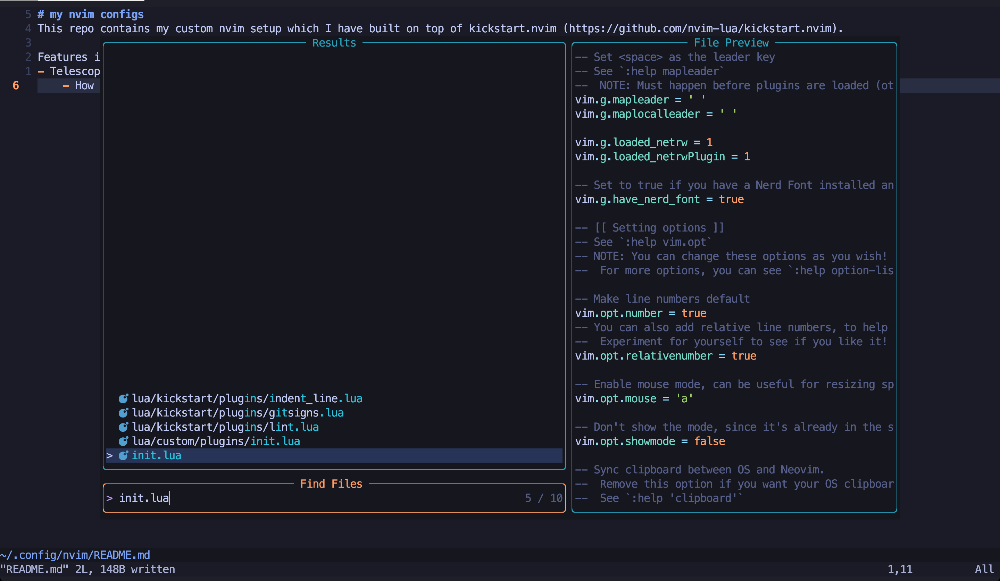
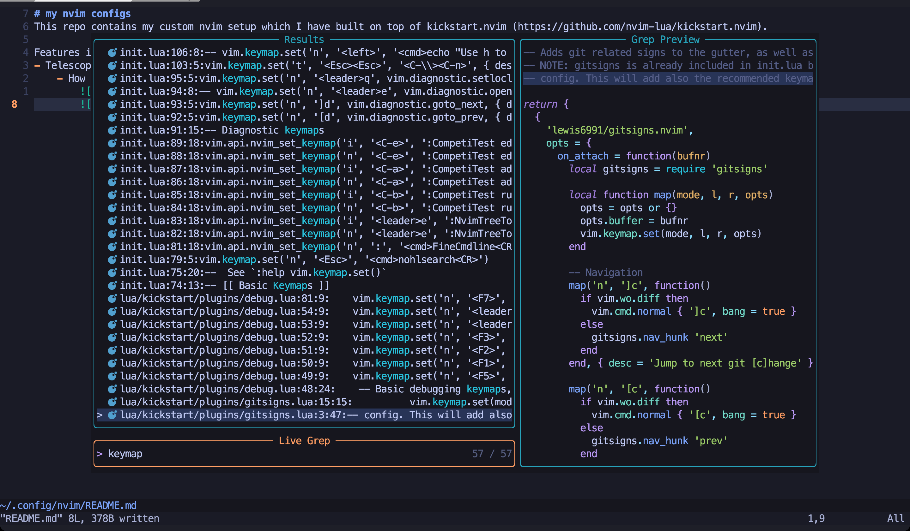
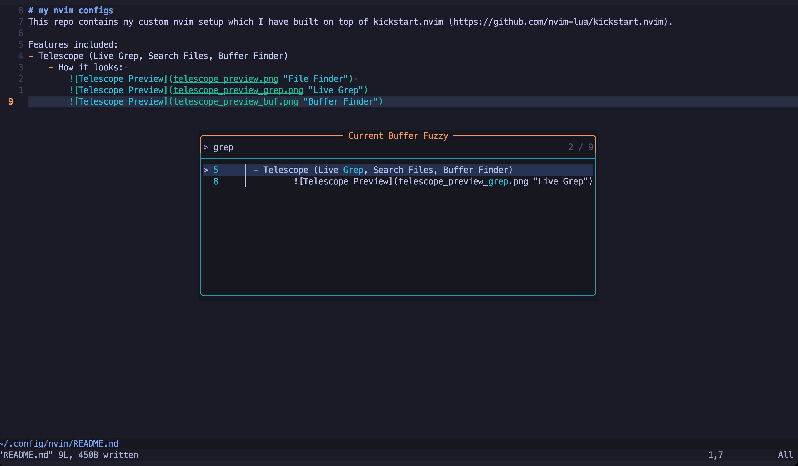

# my nvim configs
This repo contains my custom nvim setup which I have built on top of kickstart.nvim (https://github.com/nvim-lua/kickstart.nvim).

Features included:
- Telescope (Live Grep, Search Files, Buffer Finder)
    - How it looks: 
     
        **File Finder**
         
         **Live Grep**
        
         **Buffer Finder**
        
