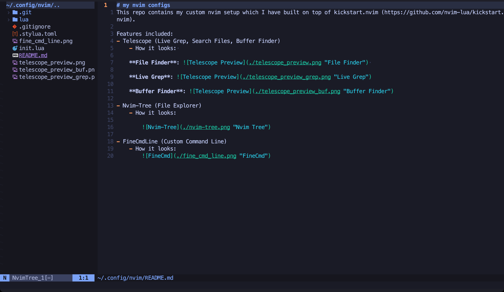

# my nvim configs
This repo contains my custom nvim setup which I have built on top of kickstart.nvim (https://github.com/nvim-lua/kickstart.nvim).

Features included:
- Telescope (Live Grep, Search Files, Buffer Finder)
    - How it looks: 

    **File Finder**:  

    **Live Grep**: 

    **Buffer Finder**: 

- Nvim-Tree (File Explorer)
    - How it looks:

        
